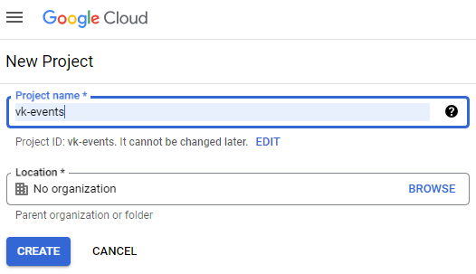
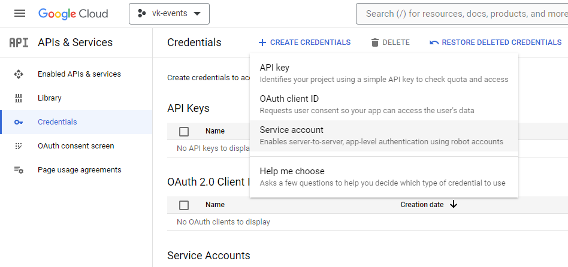
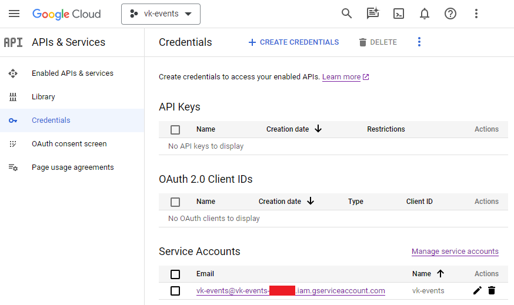
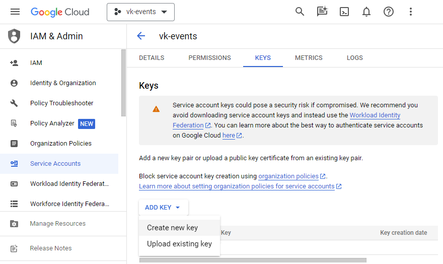
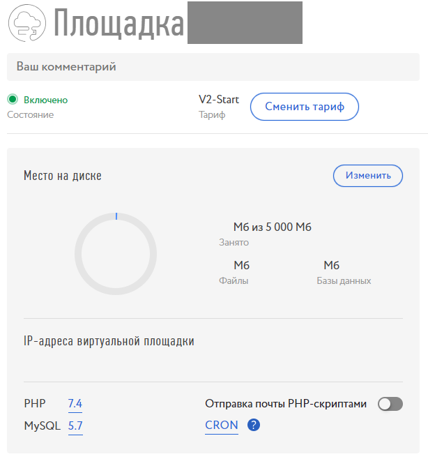

# Синхронизация событий vkontakte с google календарем

## Назначение

Скрипт предназначен для автоматического занесения в календарь google информации о событиях, на которые подписан пользователь vkontakte. Скрипт автоматичеки обновляет события в календаре, если меняется их статус, время проведения, место проведения или описание.

Для работы со скриптом пользователь должен иметь учетную запись vkontakte и учетную запись google.

## Получение ключа доступа к api vkontakte

Работа с vkontakte осуществляется по ключу доступа. Это наиболее простой путь, не требующий каких-либо библиотек, кроме `requests`. Для получения ключа необходимо пройти по ссылке: [https://oauth.vk.com/authorize?client_id=2685278&scope=offline&redirect_uri=https://api.vk.com/blank.html&response_type=token], вставив её в командную строку браузера. Здесь `client_id` - это идентификатор приложения, которым прикидывается скрипт для получения ключа. В данном случае - это идентиффикатор приложения `KateMobile`. После прохождения авторизации произойдет редирект на страницу с предупреждением. В адресной строке находим переменную `access_token`. Её значение - это и есть ключ доступа. Копируем его в файл с произвольным именем.

## Получение доступа к api google calendar

Необходимо перейти в [Google Cloud Platform Console](https://console.developers.google.com/) и нажать кнопку `NEW PROJECT`. В открывшемся диалоге вводим имя проекта. `Location` оставляем без изменений:



Далее попадаем в консоль проекта, выбираем там из списа api - Google Calendar API и нажимаем кнопку `ENABLE`. Затем заходим во вкладку `Credentials` и нажимаем кнопку `+ CREATE CREDENTIAL`.



Выбираем подменю `Service account`. В открывшемся диалоге вводим имя аккаунта и нажимаем `DONE`. После этого во вкладке `Credentials` в разделе `Service Accounts` появляется созданный нами аккаунт.



Нажимаем на имя аккаунта и переходим в диалог настройки. Выбираем вкладку `KEYS` и нажимаем кнопку `ADD KEY`, выбираем подменю `Create new key`.



В открывшемся диалоге выбираем формат ключа `JSON`, после этого откроется диалог созранения файла. Этот файл мы и будем использовать для аутентификации скриптом.

### Доступ к календарю для сервисного аккаунта

Переходим в [консоль управления календарем](https://calendar.google.com/calendar/), выбираем календарь, который хотим синхронизировать с vkontakte и заходим в его настройки. Находим строку `Открыть доступ пользователям или группам`, нажимаем кнопку `+ Добавить пользователей или группы` и вводим адрес сервисного аккаунта, который мы создали ране. Выставляем аккаунту права `внесение изменений в мероприятия`.

Прокручиваем страницу до раздела `Интеграция календаря` и сохраняем в файл `Идентификатор календаря`.

## Запуск скрипта на локальной машине

Для запуска скрипта необходимо разместить в папке с ним три файла. Названия файлов произвольны:

- `calendar-id.txt` - идентификатор календаря;
- `vk-key.txt` - ключ доступа к api vkontakte;
- `google-key.json` - ключ доступа к Google Calendar API.

В простейшем случае скрипт запускается строкой:

```
python vk-events.py --vk-token vk-key.txt --google-auth google-key.json --calendar-id calendar-id.txt
```

Для принудительного обновления событий в календаре, скрипт можно запустить в флагом `--force`

Параметр `--colors` позволяет задать различные цвета для событий, которые вомечены как "точно пойду", "возможно пойду" и "вас пригласили". Для этого, после идентификатора `--colors` следует один, два или три строковых значения, определяющие соответственно цвета для трех статусов событий. Если значение указано одно, то все события раскрашиваются в один цвет. Значения цветов могт быть следующими:

-'Default'   - По умолчанию, цвет, выбранный в настройках календаря
-'Lavender'  - цвет #7986cb
-'Sage'      - цвет #33b679
-'Grape'     - цвет #8e24aa
-'Flamingo'  - цвет #e67c73
-'Banana'    - цвет #f6c026
-'Tangerine' - цвет #f5511d
-'Peacock'   - цвет #039be5
-'Graphite'  - цвет #616161
-'Blueberry' - цвет #3f51b5
-'Basil'     - цвет #0b8043
-'Tomato'    - цвет #d60000

Пример:

```
python vk-events.py --vk-token vk-key.txt --google-auth google-key.json --calendar-id calendar-id.txt --colors Default Tangerine
```

## Настройка работы скрипта на виртуальной площадке masterhost

Загружаем по FTP или иным способом файл скрипта и ключей на виртуальную площадку. Для этого удобно создать папку прямо в корне площадки, например назвав её `cron-vk`. Далее переходим в настройки площадки и переходим в настройки CRON.



В настройке задания вводим строку вида:

~~~
cd /home/<place>/<cron-vk>/ ; python3 --vk-token vk-key.txt --google-auth google-key.json --calendar-id calendar-id.txt | tee log.txt
~~~

Где `<place>` - название площадки, а `<cron-vk>` - папка со скриптом.
Время запуска устанавливаем каждые 15 минут.

Для работы скрипта необходимо настроить окружение, а именно добавить библиотеки python, не установленные по умолчанию. Это можно сделать командой:

~~~
pip install requests google-api-python-client==1.7.9 google-auth==1.23.0 google-auth-oauthlib==0.4.1 google-auth-httplib2
~~~

Версии библиотек надо указывать явно, т.к. masterhost предоставляет python версии 3.5.3, а последние версии библиотек google и зависимых от них компонентов не поддерживают эту версию. Команду можно либо запустить через тот же cron, а потом отключить? либо подключиться по ssh и ввести её с консоли. У автора скрипта доступ по ssh был отключен, по этому он воспользовался первым вариантом.

## Работа со старыми версиями python

Для работы скрипта необходим python v3.5.3 или выше. Поддержка этой версии обоснована тем, что автор запускал свой скрипт на виртуальной площадке masterhost с тарифом V2-Start. Это наложило некоторые ограничения на синтаксис скрипта, а именно:

1. Нельзя использовать [formatted-string-literals](https://docs.python.org/3/tutorial/inputoutput.html#formatted-string-literals)

2. Нельзя использовать функцию `datetime.datetime.fromisoformat()` модуля `datetime`

3. Требуется использовать библиотеки фиксированных версий. Для работы с python v3.5.3 необходимо установить следующие пакеты:
```
pip install requests google-api-python-client==1.7.9 google-auth==1.23.0 google-auth-oauthlib==0.4.1 google-auth-httplib2
```
